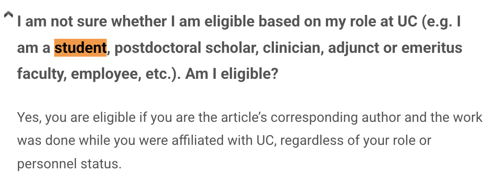

::: {.learning-objectives}
#### 🎯 Learning Objectives

After completing this module, you will be able to:

- Understand the scholarly publishing landscape and how research gets disseminated
- Take initial steps to build your online academic profile
- Create and maintain an ORCID iD
- Understand persistent identifiers (PIDs) and their role in research visibility
- Explain the difference between gold, green, and diamond open access
- Describe how the UC Open Access Policy and journal agreements apply to you
- Understand eScholarship, the UC institutional repository
:::

---

## Overview

This module walks you through the scholarly communication landscape — from understanding how research gets published, to building your online academic presence, to making your work openly accessible. **ORCID is the one thing you must remember after taking this module!**

> ✅ Complete the assignment at the end of this module and the associated knowledge check quiz on Canvas to earn credit toward your certificate!

---

## Introduction to Scholarly Publishing

Scholarly publishing is how research and creative work across all disciplines moves into the academic record — from the sciences and social sciences to the humanities and arts. Understanding this process helps you make informed decisions about where and how to publish your work.

Review the slides below for an introduction to the scholarly publishing landscape.

```{=html}
<iframe src="https://docs.google.com/presentation/d/1PIdQR--818rqp9zO5DuwHQoR1hLZC-CuodhGhfYi08k/embed?start=false&loop=false&delayms=3000"
  width="100%" height="480" frameborder="0" allowfullscreen>
</iframe>
```

---

## Building Your Academic Profile Online

Your online academic presence helps others find your work, follow your research, and recognize your contributions across platforms. Review the slides below, then watch the recording for a guided walkthrough.

```{=html}
<iframe src="https://docs.google.com/presentation/d/1GcvnC5hh5cfJ2p5nH54uuKZfTBlvvdds3LLbaAEBZ00/embed?start=false&loop=false&delayms=3000"
  width="100%" height="480" frameborder="0" allowfullscreen>
</iframe>
```

```{=html}
<iframe width="100%" height="400" src="https://www.youtube.com/embed/wtwARqzgIAQ" frameborder="0" allowfullscreen></iframe>
```

---

## ORCID & Persistent Identifiers (PIDs)

**ORCID** (Open Researcher and Contributor ID) is a free, unique digital identifier that distinguishes *you* from every other researcher, even those with the same name. Persistent identifiers (PIDs) like ORCID connect your identity across research systems automatically.

### Why ORCID Matters

- Ensures your publications are correctly attributed to you regardless of name changes or institutional affiliations
- Required by many funders (NIH, NSF) and journals for submission
- Connects to other research systems (Scopus, Web of Science, funding databases) automatically
- Saves time documenting your research contributions
- Provides fine-grained ways of documenting contributions, such as peer review experiences and services

### Getting Started with ORCID

1. Register at [orcid.org](https://orcid.org) — free and takes less than 5 minutes
2. Add your works — import from PubMed, CrossRef, or manually
3. Make your ORCID record public to maximize visibility
4. Add your ORCID iD to your email signature, CV, and manuscript submissions
5. Detailed instructions: [Getting started with your ORCID record](https://support.orcid.org/hc/en-us/articles/18498712201239-Getting-started-with-your-ORCID-record) · [Optimize your ORCID profile](https://info.orcid.org/researchers/#optimize)

Review the slides below, then watch the workshop recording to see ORCID and PIDs in action.

```{=html}
<iframe src="https://docs.google.com/presentation/d/1hzyS0GB2R8HboDmhA1rqY7LGSkOJyXs1/embed?start=false&loop=false&delayms=3000"
  width="100%" height="480" frameborder="0" allowfullscreen>
</iframe>
```

```{=html}
<iframe width="100%" height="400" src="https://www.youtube.com/embed/bkbvW0VQIOk" frameborder="0" allowfullscreen></iframe>
```

::: {.callout-note collapse="true"}
### Should my ORCID record only include peer-reviewed articles?

No. Your ORCID record should include all types of scholarly outputs — peer-reviewed articles, preprints, conference presentations, datasets, software, and more. The more complete your record, the better it reflects your full research contribution.
:::

---

## Open Access Publishing

Open access (OA) means making your research freely available online to anyone, anywhere, without a paywall.

### Three Common Types of Open Access

{fig-alt="Diagram showing three types of open access: gold, green, and diamond."}

| Type | Description | Cost to Author |
|---|---|---|
| **Gold OA** | Published in a fully open access journal | Article Processing Charge (APC) — Use the [JOLT journal look up tool](https://jolt.cdlib.org/) to see if a UC agreement can cover the APC fee partially or fully |
| **Green OA** | Deposit a preprint or accepted manuscript in a repository such as eScholarship | Free |
| **Diamond OA** | Published open access with no cost to author or reader | Free |

---

## UC Open Access Policy, Journal Agreements & eScholarship

### UC Open Access Policy

The Academic Senate of the University of California adopted an Open Access Policy ensuring that future research articles authored by all UC employees would be made available to the public at no charge once authors deposit them into [eScholarship](https://escholarship.org), UC's open access repository.

{fig-alt="Diagram showing UC open access policy coverage."}

More information: [UC Open Access Policy](https://osc.universityofcalifornia.edu/for-authors/open-access-policy/) · Questions: Dr. Jing Han · [jingh@ucr.edu](mailto:jingh@ucr.edu)

::: {.callout-note collapse="true"}
### Does the UC Open Access Policy apply to me as a graduate student?

If you are a graduate student **paid by the UC system**, then this policy applies to you. You may opt out of the policy for any article for any reason. Contact Dr. Jing Han ([jingh@ucr.edu](mailto:jingh@ucr.edu)) if you have questions.
:::

### UC Open Access Journal Agreements

> **Note:** UC Open Access Journal Agreements are separate from the UC Open Access Policy above. They are negotiated agreements between the UC system and publishers that allow UC-affiliated authors to publish open access in participating journals, covering APC (Article Processing Charge) fees fully or partially.

As a UC graduate student, **you are eligible** for these agreements as long as you are the article's corresponding author and the work was done while you were affiliated with UC — regardless of your role or personnel status.

{fig-alt="FAQ showing that UC OA agreements cover all UC-affiliated personnel including students."}

- Use the [**JOLT Journal Look Up Tool**](https://jolt.cdlib.org/) to check whether a specific journal is covered by a UC OA agreement
- Learn more: [UC OA Agreements FAQ](https://osc.universityofcalifornia.edu/uc-publisher-relationships/oa-agreements-general-faq/)

### eScholarship

[**eScholarship**](https://escholarship.org/aboutEschol) is the UC System's open access publishing platform and institutional repository. It gives departments, research units, and individual scholars direct control over disseminating their scholarship.

- **UCR's eScholarship instance:** [escholarship.org/uc/ucr](https://escholarship.org/uc/ucr)
- Your **ProQuest thesis/dissertation submissions are deposited into eScholarship automatically**

::: {.callout-note collapse="true"}
### What is eScholarship and how is it related to me as a UCR graduate student?

eScholarship is the UC System's Open Access Publishing Platform and Institutional Repository. It provides scholarly publishing and repository services that enable departments, research units, publishing programs, and individual scholars associated with the University of California to have direct control over the creation and dissemination of the full range of their scholarship.

Each UC campus has its own instance. You can explore UCR's eScholarship instance [HERE](https://escholarship.org/uc/ucr). Your ProQuest thesis and dissertation submissions will be deposited automatically.
:::

Review the slides and watch the recording below to learn how to navigate open access repositories and publish with eScholarship.

```{=html}
<iframe src="https://docs.google.com/presentation/d/1bEuvrgRAY0GXa53yfsNnMNH0kY0DFAjy/embed?start=false&loop=false&delayms=3000"
  width="100%" height="480" frameborder="0" allowfullscreen>
</iframe>
```

```{=html}
<iframe width="100%" height="400" src="https://www.youtube.com/embed/rKH-Gc97xwk" frameborder="0" allowfullscreen></iframe>
```

---

## Assignment

::: {.callout-important}
### 📋 Assignment: What Is Your ORCID?

1. Register for an ORCID iD at [orcid.org](https://orcid.org) (if you don't have one already)
2. Add at least **2 works** to your ORCID record (institutional affiliation, educational experience, publications, presentations, preprints, services, awards, peer review or other works)
3. Submit your **ORCID iD URL** (e.g., `https://orcid.org/0000-0000-0000-0000`) to the Canvas course platform

*This assignment is required for the certificate.*
:::

---

## Get Help

- 🗓️ UCR Library offers synchronous **Scholarly Communication workshops** — check upcoming sessions at [library.ucr.edu](https://library.ucr.edu)
- 🔗 [UCR Scholarly Communication Services](https://library.ucr.edu/research-support/scholarly-communication-services)
- 📧 **Digital Scholarship Librarian:** Dr. Jing Han · [jingh@ucr.edu](mailto:jingh@ucr.edu)
- 📧 **STEM Collection Strategist:** Michele Potter · [michele.potter@ucr.edu](mailto:michele.potter@ucr.edu)

---

```{=html}
<div class="next-module-banner">
  <a href="03-data-management.qmd">
    <div>
      <div class="next-label">Up Next · Module 3</div>
      <div class="next-title">Data Management</div>
    </div>
    <div class="next-arrow">→</div>
  </a>
</div>
```
