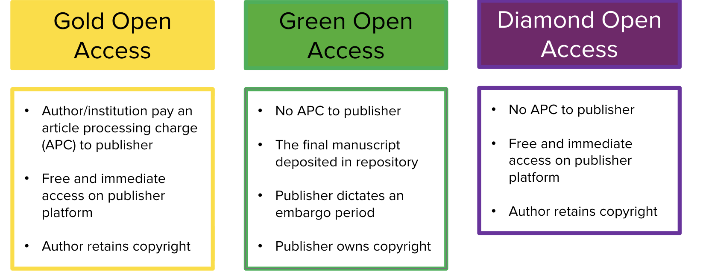
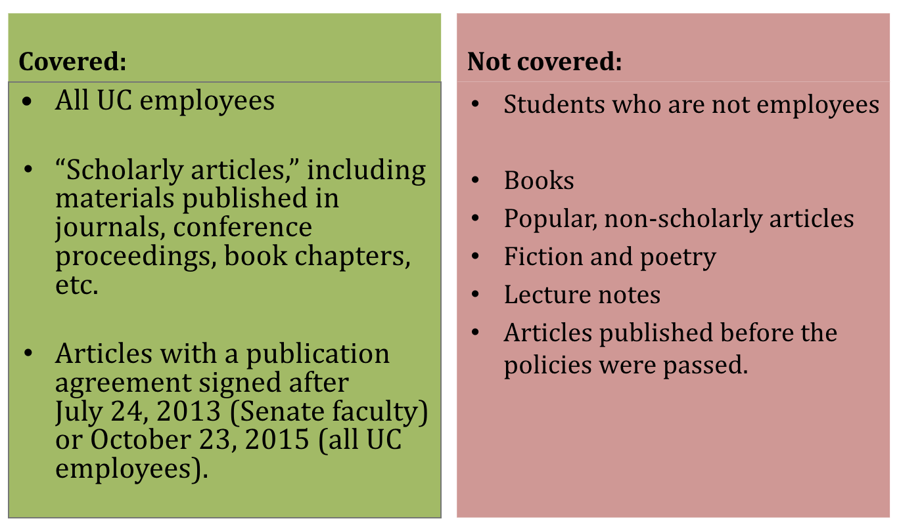

::: {.learning-objectives}
#### 🎯 Learning Objectives

After completing this module, you will be able to:

- Create and maintain an ORCID iD
- Understand persistent identifiers (PIDs) and their role in research visibility
- Explain the difference between gold, green, and diamond open access
- Describe how eScholarship and the UC Open Access Policy apply to you
- Take initial steps to build your online academic profile
:::

---

## Overview

This module introduces online academic profiles, open access publishing, and the tools that make your scholarship visible and discoverable. In addition to this summary webpage, review the presentation slides, recordings, and other resources in the Resources Section to learn more. **ORCID is the one thing you must remember after taking this module!**

> ✅ Complete the assignment at the end of this module and the associated knowledge check quiz on Canvas to earn credit toward your certificate!

---

## ORCID: Your Persistent Research Identity

**ORCID** (Open Researcher and Contributor ID) is a free, unique digital identifier that distinguishes *you* from every other researcher, even those with the same name.

### Why ORCID Matters

- Ensures your publications are correctly attributed to you regardless of name changes or institutional affiliations
- Required by many funders (NIH, NSF) and journals for submission
- Connects to other research systems (Scopus, Web of Science, funding databases) automatically
- Saves time to document your research contributions
- Provides "unconventional" fine-grained ways of documenting your research contributions, such as peer review experiences and services.

### Getting Started with ORCID

1. Register at [orcid.org](https://orcid.org). It's free and takes less than 5 minutes
2. Add your works — import from PubMed, CrossRef, or manually
3. Make your ORCID record public to maximize visibility
4. Add your ORCID iD to your email signature, CV, and manuscript submissions
5. Learn more about how to get started with ORCID and detailed instructions on ORCID [Here](https://info.orcid.org/researchers/#optimize) and [Here](https://support.orcid.org/hc/en-us/articles/18498712201239-Getting-started-with-your-ORCID-record)

---

## Open Access Publishing

Open access (OA) means making your research freely available online to anyone, anywhere, without a paywall. You might have heard about other terms starting with "open", such as open data, open source, open educational resources (OER). But in this section, we focus on open access publishing.

### Three Common Types of Open Access

{fig-alt="Diagram showing three types of open access: gold, green, and diamond."}

| Type | Description | Cost to Author |
|---|---|---|
| **Gold OA** | Published in a fully open access journal | Article Processing Charge (APC) — Use the [JOLT journal look up tool](https://jolt.cdlib.org/) to see if UC Open Access Agreement can cover the charges|
| **Green OA** | Deposit a preprint or accepted manuscript in a repository, such as eScholarship (UC's institutional repository) | Free |
| **Diamond OA** | Published open access with no cost to author or reader | Free |

---

## eScholarship & the UC System

[**eScholarship**](https://escholarship.org/aboutEschol) is the UC System's open access publishing platform and institutional repository. It gives departments, research units, and individual scholars direct control over disseminating their scholarship.

- **UCR's eScholarship instance:** [escholarship.org/uc/ucr](https://escholarship.org/uc/ucr)
- As a UCR graduate student, you can deposit published articles (most likely but consult with UCR eScholarship liaison to learn more: Dr. Jing Han · [jingh@ucr.edu](mailto:jingh@ucr.edu)), presentations, recordings, and other academic work
- Your **ProQuest thesis/dissertation submissions are deposited into eScholarship automatically**
- Questions? Contact UCR eScholarship liaison: Dr. Jing Han · [jingh@ucr.edu](mailto:jingh@ucr.edu)

---

## UC Open Access Policy

The UC Open Access Policy allows UC employees (including graduate students paid by the UC system) to:

- Retain copyright to their work
- Grant UC a non-exclusive license to distribute and display their work
- Deposit articles in an open access repository or publish in an OA journal

{fig-alt="Diagram showing UC open access policy coverage."}

More information: [UC Open Access Policy](https://osc.universityofcalifornia.edu/for-authors/open-access-policy/) · Questions: Dr. Jing Han · [jingh@ucr.edu](mailto:jingh@ucr.edu)

---

## Frequently Asked Questions

::: {.callout-note collapse="true"}
### What is eScholarship and how is it related to me as a UCR graduate student?

eScholarship is the UC System's Open Access Publishing Platform and Institutional Repository. It provides scholarly publishing and repository services that enable departments, research units, publishing programs, and individual scholars associated with the University of California to have direct control over the creation and dissemination of the full range of their scholarship.

Each UC campus has its own instance. You can explore UCR's eScholarship instance [HERE](https://escholarship.org/uc/ucr). As a UCR graduate student, you can deposit a copy of your academic work into eScholarship. Your ProQuest thesis and dissertation submissions will be deposited automatically.
:::

::: {.callout-note collapse="true"}
### Does the UC Open Access Policy apply to me as a graduate student?

If you are a graduate student **paid by the UC system**, then this policy applies to you. You may opt out of the policy for any article for any reason. Contact Dr. Jing Han ([jingh@ucr.edu](mailto:jingh@ucr.edu)) if you have questions.
:::

::: {.callout-note collapse="true"}
### Should my ORCID record only include peer-reviewed articles?

No. Your ORCID record should include all types of scholarly outputs — peer-reviewed articles, preprints, conference presentations, datasets, software, and more. The more complete your record, the better it reflects your full research contribution.
:::

---

## Resources

::: {.resource-list}
- [**Slides: Academic Profile Online**](https://docs.google.com/presentation/d/1y1wnzcjttLn72XkikLVPSy2lt6rAB91k/edit?usp=drive_link&rtpof=true&sd=true)
  [Slides]{.resource-type .slides}

- [**Slides: ORCID and More — PIDs for Increasing Research Visibility**](https://docs.google.com/presentation/d/1hzyS0GB2R8HboDmhA1rqY7LGSkOJyXs1/edit?usp=sharing&rtpof=true&sd=true)
  [Slides]{.resource-type .slides}

- [**Recording: ORCID and PIDs**](https://www.youtube.com/watch?v=bkbvW0VQIOk)
  [Video]{.resource-type .video}

- [**Slides: Introduction to Scholarly Publishing**](https://docs.google.com/presentation/d/1PIdQR--818rqp9zO5DuwHQoR1hLZC-CuodhGhfYi08k/edit?usp=sharing)
  [Slides]{.resource-type .slides}

- [**UCR Scholarly Communication Services**](https://library.ucr.edu/research-support/scholarly-communication-services)
  [Website]{.resource-type}
:::

---

## Assignment

::: {.callout-important}
### 📋 Assignment: What Is Your ORCID?

1. Register for an ORCID iD at [orcid.org](https://orcid.org) (if you don't have one already)
2. Add at least **2 works** to your ORCID record (institutional affiliation, educational experience, publications, presentations, preprints, services, awards, peer review or other works)
3. Submit your **ORCID iD URL** (e.g., `https://orcid.org/0000-0000-0000-0000`) to the Canvas course platform

*This assignment is required for the certificate.*
:::

---

## Get Help

- 🗓️ UCR Library offers synchronous **Scholarly Communication workshops** sometimes, check the upcoming sessions at [library.ucr.edu](https://library.ucr.edu)
- 📧 **Digital Scholarship Librarian :** Dr. Jing Han · [jingh@ucr.edu](mailto:jingh@ucr.edu)
- 📧 **STEM Collection Strategist:** Michele Potter · [michele.potter@ucr.edu](mailto:michele.potter@ucr.edu)
- 🔗 [UCR Scholarly Communication Services](https://library.ucr.edu/research-support/scholarly-communication-services)

---

```{=html}
<div class="next-module-banner">
  <a href="03-data-management.qmd">
    <div>
      <div class="next-label">Up Next · Module 3</div>
      <div class="next-title">Data Management</div>
    </div>
    <div class="next-arrow">→</div>
  </a>
</div>
```
