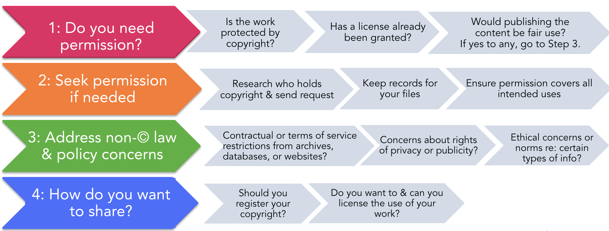

::: {.learning-objectives}
#### 🎯 Learning Objectives

After completing this module, you will be able to:

- Understand who owns the copyright to your thesis or dissertation
- Identify materials in your thesis/dissertation that may require permission
- Apply fair use principles to digital projects and academic work
- Understand Creative Commons licenses and choose the right one
- Navigate the path from dissertation to book or journal publication
:::

---

## Overview

This module covers **copyright, licenses, fair use**, and how to share and publish your thesis and dissertation with a publisher. It also introduces ProQuest submission, which is a graduation requirement covered in depth in Module 6.

> ✅ Complete the quiz assignment on Canvas to earn credit toward your badge!

---

## Copyright Basics for Graduate Students

### Who Owns Your Thesis or Dissertation?

In the U.S., **you (the author)** typically own the copyright to your thesis or dissertation. Copyright is established at the moment of creation.

::: {.callout-note}
**Important nuance:** If a version of your dissertation is being published with a commercial publisher, the publisher agreement you sign may transfer some or all rights. Always read your publishing agreement carefully before signing.
:::

### What This Means for You

- You can deposit your work in open access repositories (eScholarship, UC's institutional repository)
- You can post to your personal website
- You must comply with any agreements you've signed with publishers for previously published chapters

Review the slides and watch the recording below for a full overview of copyright as it applies to your thesis and dissertation.

```{=html}
<iframe src="https://docs.google.com/presentation/d/1XVaSMT6icxuWbQ_pCGVwKyQZxqLjtw7pV42AqhBS5vQ/embed?start=false&loop=false&delayms=3000"
  width="100%" height="480" frameborder="0" allowfullscreen>
</iframe>
```

```{=html}
<iframe width="100%" height="400" src="https://www.youtube.com/embed/7RKfl4rWJ2E" frameborder="0" allowfullscreen></iframe>
```

---

## Copyright Decision Framework

When using third-party content or sharing your own work, work through the following four steps.

{fig-alt="A four-step copyright decision workflow. Step 1: Do you need permission? Step 2: Seek permission if needed. Step 3: Address non-copyright law and policy concerns. Step 4: How do you want to share?" width="100%"}

### Step 1: Do You Need Permission?

Ask three questions in sequence:

- **Is the work protected by copyright?** Works in the public domain (old enough, U.S. government works, or CC-licensed) do not require permission.
- **Has a license already been granted?** If the work carries a Creative Commons or open license, check its terms — you may already have permission.
- **Would your use be fair use?** If yes to any of these questions, skip to Step 3. Otherwise, continue to Step 2.

**Fair use** is a legal doctrine allowing limited use of copyrighted material without permission. Four factors are weighed:

1. **Purpose** — Educational/transformative use favored over commercial use
2. **Nature** — Factual works favored over creative works
3. **Amount** — Smaller portions favored over large portions
4. **Market effect** — Uses that don't harm the market for the original are favored

::: {.callout-warning}
Fair use determinations depend heavily on the specific facts of each case. When in doubt, seek permission or consult a librarian. UCR Library does not provide legal advice, but can help you think through the analysis.
:::

### Step 2: Seek Permission if Needed

If permission is required:

- **Research who holds the copyright** — it may be the author, publisher, or another rights holder — and send a written request.
- **Keep records** of all correspondence and permissions granted.
- **Ensure the permission covers all intended uses** — print and digital, all jurisdictions, etc.

Common materials in theses and dissertations that may require permission:

- 📷 **Photographs** taken by others
- 🗺️ **Maps** from published sources
- 📊 **Figures, tables, or graphs** from journal articles or books
- 🎵 **Music** (lyrics, scores, recordings)
- 🎬 **Film stills** or video clips (including screenshots of YouTube videos)

Even if something is freely available online or you own a copy of a book, this **does not** mean you have permission to reproduce it.

### Step 3: Address Non-Copyright Law & Policy Concerns

Even when copyright is not an issue, consider:

- **Contractual or terms of service restrictions** from archives, databases, or websites that limit how their content may be used.
- **Privacy or publicity rights** — concerns about identifiable individuals in your data or images.
- **Ethical norms** — certain types of information (e.g., Indigenous cultural knowledge, sensitive research data) may carry obligations beyond copyright law.

### Step 4: How Do You Want to Share?

Once copyright and policy concerns are resolved, decide how to make your work available:

- **Register your copyright** — optional in the U.S., but registration provides legal advantages if infringement occurs. ProQuest offers registration at the time of dissertation submission.
- **License your work** — Creative Commons licenses let you specify exactly what others can do with it (see below).

Review the slides and recording below for a deeper dive into copyright and fair use for digital projects.

```{=html}
<iframe src="https://docs.google.com/presentation/d/1sjOKJPA4bcc-1L7Cwv7nwUpB1cZG3Xy3lKpcLocUvA4/embed?start=false&loop=false&delayms=3000"
  width="100%" height="480" frameborder="0" allowfullscreen>
</iframe>
```

```{=html}
<iframe width="100%" height="400" src="https://www.youtube.com/embed/vmX6g9NZ_4g" frameborder="0" allowfullscreen></iframe>
```

---

## Creative Commons Licenses

If you want to make your work openly available, Creative Commons (CC) licenses let you specify exactly what others can do with it:

| License | Code | Meaning |
|---|---|---|
| Attribution | CC BY | Others can use freely with credit |
| Attribution-ShareAlike | CC BY-SA | Must share under same license |
| Attribution-NonCommercial | CC BY-NC | No commercial use |
| Attribution-NoDerivatives | CC BY-ND | No modifications allowed |
| Attribution-NonCommercial-ShareAlike | CC BY-NC-SA | NC + SA combined |

Most open access funders (NIH and government funding agencies) require **CC BY**.

---

## From Dissertation to Publication

Turning your dissertation into a book or journal articles is an exciting but complex process.

### Journal Articles

1. Identify target journals in your field
2. Check the journal's submission requirements and copyright policy
3. Adapt your dissertation chapter to article format (typically 6,000–10,000 words)
4. Submit and revise through peer review

### Book Publication

1. Identify academic presses in your field
2. Prepare a book proposal (overview, chapter summaries, market analysis)
3. Navigate the peer review and revision process
4. Review your publisher agreement carefully

Watch the recording below for a walkthrough of navigating the dissertation-to-book publication process.

```{=html}
<iframe width="100%" height="400" src="https://www.youtube.com/embed/g4VduJLstBY" frameborder="0" allowfullscreen></iframe>
```

For additional perspective, this optional webinar covers book publishing specifically for first-generation scholars:

```{=html}
<iframe width="100%" height="400" src="https://www.youtube.com/embed/R3QSi5NMBNA" frameborder="0" allowfullscreen></iframe>
```

### ProQuest Submission

Submitting your thesis or dissertation to ProQuest is a **graduation requirement** — this is separate from transforming your work into a publication with a commercial publisher. See [Module 6: Graduate Academic Affairs](06-graduate-academic-affairs.qmd) for the full submission process.

---

## Assignment

::: {.callout-important}
### 📋 Assignment: Publish and Share Your Thesis and Dissertation Quiz

Complete the quiz on Canvas to earn credit toward your badge.

*This assignment is required for the badge.*
:::

---

## Get Help

- 📧 **Digital Scholarship Librarian:** Dr. Jing Han · [jingh@ucr.edu](mailto:jingh@ucr.edu)
- 🔗 [UCR Graduate Division Filing Resources](https://graduate.ucr.edu/filing-resources#formatting-and-submission-link)

---

```{=html}
<div class="next-module-banner">
  <a href="06-graduate-academic-affairs.qmd">
    <div>
      <div class="next-label">Up Next · Module 6</div>
      <div class="next-title">Graduate Academic Affairs</div>
    </div>
    <div class="next-arrow">→</div>
  </a>
</div>
```
